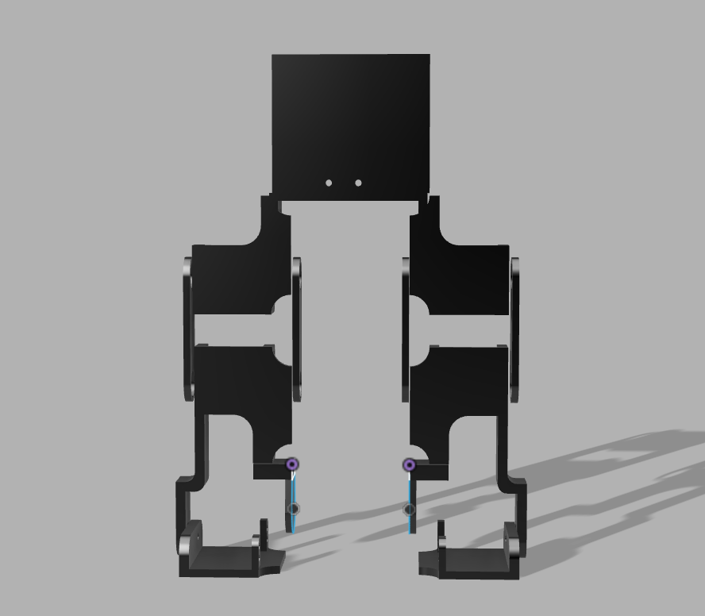
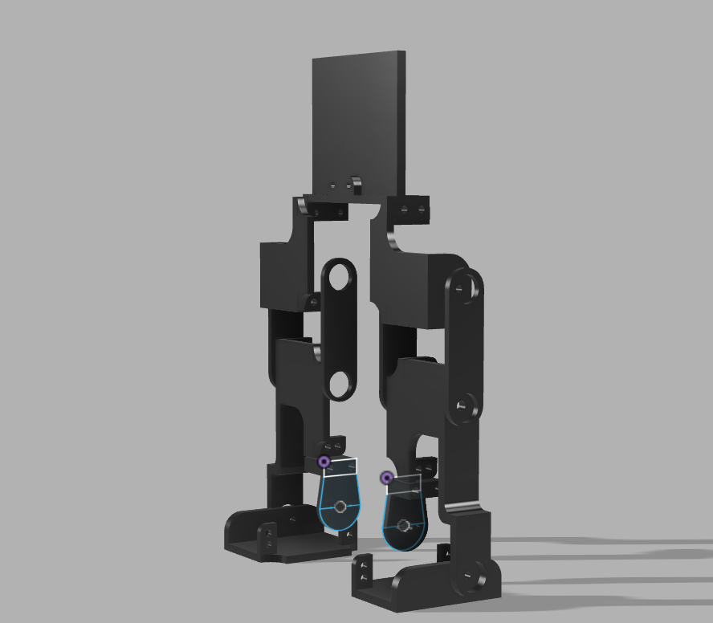
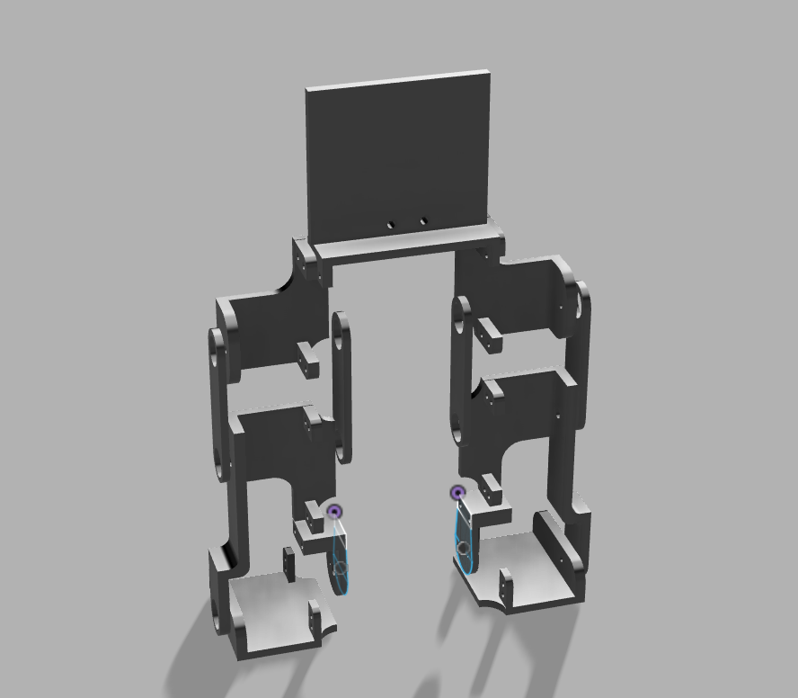

# tek

**tek** is a wireless bipedal robot built with an **Arduino UNO R4 WiFi** and a custom-designed mechanical body. The project focuses on creating a compact two-legged platform capable of coordinated movement while keeping the hardware and mechanical design simple.

it features:

- Arduino UNO R4 WiFi for control and wireless connectivity
- Two articulated legs driven by servo motors
- Custom-designed and 3D-printable mechanical structure

## design

bipeds are robots that use two legs to move, so balance and weight distribution are pretty important. the legs need to move together and the joints have to be positioned so the robot can shift its weight without falling over.

for tek, i kept the design simple and focused on the basic idea of a biped. the body is centered between the two legs, with the servos placed around the joints to control their movement. i also kept both sides symmetrical to make the robot easier to balance and assemble.

## electronics

the **Arduino UNO R4 WiFi** acts as the central controller for the robot, providing the processing and wireless connectivity needed to control the servos and operate the biped remotely.

the servos drive the individual joints of the legs, allowing the two sides of the robot to be coordinated during movement.

## CAD

final 3d mockup of the biped.

|                                     |                                   |                                   |
| ----------------------------------- | --------------------------------- | --------------------------------- |
|  |  |  |

STL files are available in [`CAD/stl`](CAD/stl).

> [!NOTE]
> The STL folder contains every required part duplicated for the complete build. Each STL file only needs to be printed once, so you can print the entire set without manually figuring out how many copies of each part are required.

## BOM

the complete bill of materials is available in [`bom.csv`](bom.csv).
